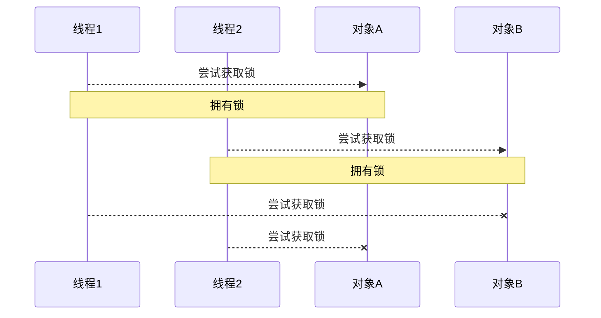
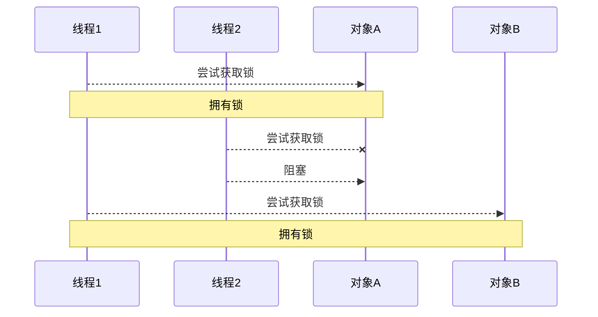

# 进程和线程

## 进程和线程

### 进程

* 程序由指令和数据组成，但这些指令哟啊运行，数据要读写，就必须把指令加载至CPU，数据加载至内存。在指令运行过程中还需要用到磁盘，网络等设备。进程就是用来加载指令，管理内存，管理IO的
* 当一个程序被运行，从磁盘加载这个程序的代码至内存，这时就开启了一个线程
* 进程就可以视为程序的一个实例，大部分程序可以同时运行多个实例进程，有的程序也只能启动一个实例进程。

### 线程

* 一个进程之内可以分为一到多个线程
* 一个进程就是一个指令流，将指令流中的一条条指令以一定的顺序交给CPU执行
* Java中，戏线程作为最小调度单位，进程作为资源分配的最小单位。在windows中进程是不活动的，只是作为线程的容器

### 对比

* 进程基本上是相互独立的，而线程存在于进程内，是进程的一个子集
* 进程拥有共享的资源，如内存空间等，供内部的线程共享
* 进程间通信较为复杂
  * 同一台计算机的进程通信叫IPC
  * 不同计算机之间的进程通信，需要通过网络，并遵循共同的协议
* 线程通信相对简单，因为他们共享进程内的内存，一个例子是多个线程可以访问同一个共享变量
* 线程更轻量，线程上下文切换成本一般比进程上下文切换低


## 并行与并发

单核cpu下，线程实际还是`串行执行`的。操作系统中有一个组件叫做任务调度器，将cpu的时间片（windows下时间片最小约15ms）分给不同的线程使用，只是由于cpu在线程之间的切换非常快，人类觉得是同时运行的。总结一句话**微观串行，宏观并行**

一般会把这种线程轮流使用CPU的方法称为**并发，concurrent**


多核cpu下，每个核都可以调度运行线程，这时候线程是可以**并行**的。

## 应用

### 异步调用

从方法调用的角度来讲，如果

* 需要等待结果返回，才能继续运行就是同步
* 不需要等待结果返回，就能继续运行就是异步

注意：同步在多线程中还有另外一层意思，就是让多个线程步调一致

### 效率提升


# Java线程

* 创建和运行线程
* 查看线程
* 线程API
* 线程状态

## 创建和运行线程

方法一，直接使用Thread

方法二，使用Runnable融合Thread

方法三，FutureTask配合Thread


## 观察多个线程同时运行


## 查看线程进程的方法

* tasklist


## 原理之线程运行

### 栈与栈帧

### 线程上下文切换（Thread Context Switch）

因为以下原因导致cpu不再执行当前线程，转而执行另一个线程的代码

* 线程的cpu时间片用完
* 垃圾回收
* 有更高优先级的线程需要运行
* 线程自己调用了sleep,yield,wait,join,park,synchronized,lock等方法

当上下文切换发生时，需要有操作系统保存当前线程的状态，并恢复另一个线程的状态，Java中对应的概念就是程序计数器，作用是记住下一条jvm命令的执行地址，是线程私有的

* 状态包括程序计数器，栈帧信息，如局部变量，操作数栈返回地址等
* 频繁的上下文切换会影响性能

## 常见方法

* start：启动线程，让线程就绪
  * 里面的代码不一定立刻运行（cpu的时间片还没分给他），只能调用一次
* run：线程启动后运行的方法
* join：等待线程运行结束
* set，get方法
* sleep：休眠
* yield：礼让

### start与run

调用start会把当前线程从`NEW`状态进入`RUNNABLE`状态

### sleep与yield

#### sleep

1. 调用sleep会让当前线程从`RUNNABLE`进入`TIMED_WAITING`状态
2. 其他线程可以使用`interrupt`方法打断正在睡眠的线程，这时sleep方法会抛出`InterruptedException`
3. 睡眠结束后的线程未必会立刻得到执行
4. 建议用`TimeUnit`的sleep代替Thread的sleep来获得更好的可读性

#### yield

1. 调用yield会让当前线程从`RUNNING`进入`RUNNABLE`就绪状态，然后调度其它2同优先级的线程。如果这时没有同优先级的线程，那么不能保证让当前线程暂停的效果
2. 具体的实现依赖于os的任务调度器

#### 线程优先级

* 线程优先级会提示（hint）调度器优先调度该线程，但它仅仅是一个提示，调度器可以忽略它
* 如果cpu比较忙，那么优先级高的线程会获得更多的时间片，但cpu闲时，优先级几乎没用。

### join

等待某个线程运行结束

### interrput

#### 打断sleep，wait，join

这三个被打断之后，会清除标记，导致调用`isInterrupted()`方法，会输出false

#### 打断正常运行的线程

#### 两阶段终止模式

**在一个线程中优雅地终止另一个线程，优雅指的是给被中止的线程一个办理后事的机会**

#### 打断park线程

## 主线程与守护线程

主线程结束后，守护线程会被迫结束

## 五种状态

从**操作系统**层面来描述的


## 六种状态

从**Java API**层面来描述的


16:14:18.757 [main] DEBUG TestState -- t1 state NEW
16:14:18.758 [main] DEBUG TestState -- t2 state RUNNABLE
16:14:18.758 [main] DEBUG TestState -- t3 state TERMINATED
16:14:18.758 [main] DEBUG TestState -- t4 state TIMED_WAITING
16:14:18.758 [main] DEBUG TestState -- t5 state WAITING
16:14:18.758 [main] DEBUG TestState -- t6 state BLOCKED

```java
import lombok.extern.slf4j.Slf4j;

@Slf4j
public class TestState {
    public static void main(String[] args) {
        Thread t1 = new Thread("t1"){
            @Override
            public void run() {
                log.debug("running...");
            }
        };

        Thread t2 = new Thread("t2"){
            @Override
            public void run() {
                while (true){

                }
            }
        };
        t2.start();

        Thread t3 = new Thread("t3"){
            @Override
            public void run() {
                log.debug("running...");
            }
        };
        t3.start();

        Thread t4 = new Thread("t4"){
            @Override
            public void run() {
                synchronized (TestState.class){
                    try {
                        Thread.sleep(10000000);
                    } catch (InterruptedException e) {
                        e.printStackTrace();
                    }
                }
            }
        };
        t4.start();

        Thread t5 = new Thread("t5"){
            @Override
            public void run() {
                try {
                    t2.join();
                } catch (InterruptedException e) {
                    e.printStackTrace();
                }
            }
        };
        t5.start();

        Thread t6 = new Thread("t6"){
            @Override
            public void run() {
                synchronized (TestState.class){
                    try {
                        Thread.sleep(1000000);
                    } catch (InterruptedException e) {
                        e.printStackTrace();
                    }
                }
            }
        };
        t6.start();

        try {
            Thread.sleep(500);
        } catch (InterruptedException e) {
            e.printStackTrace();
        }

        log.debug("t1 state {}",t1.getState());
        log.debug("t2 state {}",t2.getState());
        log.debug("t3 state {}",t3.getState());
        log.debug("t4 state {}",t4.getState());
        log.debug("t5 state {}",t5.getState());
        log.debug("t6 state {}",t6.getState());
    }
}

```

# 共享模型之管程

## 共享问题

### 问题分析

原子性无法得到保证，导致数据脏写脏读

### 临界区 Critical Section

* 一个程序运行多个线程本身是没有问题的
* 问题出现在多个线程访问**共享资源**
  * 多个线程**读**共享资源也没问题
  * 在多个线程对共享资源读写操作时发生指令交错，就会出现问题
* 一段代码块如果存在对**共享资源**的多线程读写操作，就称这段代码为**临界区**

## synchronized

### 应用之互斥

为了避免临界区的竞态条件发生，有多种手段可以达到目的。

* 阻塞式的解决方案：synchronized，Lock
* 非阻塞式的解决方案：原子变量

synchronized，俗称**【对象锁】**，采用互斥的方式让同一时刻至多只有一个线程能持有对象锁，其他线程在想获取这个对象锁就会被阻塞住。这样就能保证用有锁的线程可以安全的执行临界区内的代码，不用担心线程的上下文切换

**要用同一把锁，否则和没加锁没区别**

### 锁的位置

`public synchronized void a()`，锁住的是`this`对象，即调用者本身

`public static synchronized void a()`，锁住的是类的类对象`Myclass.class`

## 线程安全分析

### 成员变量和静态变量

* 如果它们没有共享，则线程安全
* 如果它们被共享了，根据它们的状态是否能够改变，又分两种情况
  * 如果只有读操作，则线程安全
  * 如果有读写操作，则这段代码是临界区，需要考虑线程安全

### 局部变量

* 局部变量是线程安全的
* 但局部变量引用的对象未必
  * 如果该对象没有逃离方法的作用范围，它是线程安全的
  * 如果该对象逃离方法的作用范围，则需要考虑线程安全

### 成员变量

创建一个该类的实例对象，并使用实例对象的method1方法重写多个线程的run方法时，由于`add`方法不是原子性的，所以会导致线程不安全问题发生

```java
class ThreadUnsafe{
    ArrayList<String> list = new ArrayList<>();
    public void method1(int loopNumber){
        for (int i = 0; i < loopNumber; i++) {
            method2();
            method3();
        }
    }

    private void method2() {
        list.add("1");
    }

    private void method3() {
        list.remove(0);
    }
}
```

### 常见线程安全类

* String
* Integer
* StringBuffer
* Random
* Vector
* Hashtable
* java.util.concurrent包下的类

说它们线程安全指的是，多个线程调用它们同一个实例的某个方法时，是线程安全的。也可以理解为：

* 它们的每个方法是原子的
* 但**注意**它们多个方法的组合不是原子的


## Monitor

### Java对象头


### Monitor

Monitor被翻译为**监视器**或**管程**

每个Java对象都可以关联一个Monitor对象，如果使用synchronized给对象加上锁（重量级）之后，该对象的Mark Word中就被设置指向Monitor对象的指针

Monitor对象结构


* 刚开始Monitor中Owner为null
* 当Thread-2执行synchronized后，mointor中的owner变成Thread-2，owner只能有一个
* 其他线程执行到synchronized，发现owner中已经有了线程，就会进入EntryList被阻塞
* 从而保证了多线程并发情况下的原子性操作

## synchronized原理进阶

### 轻量级锁

轻量级锁的使用场景：如果一个对象虽然有多线程访问，但多线程访问的时间是错开的（也就是没有竞争），那么可以用轻量级锁来优化。

轻量级锁对使用者是透明的，即语法仍然是synchronized

假设有两个方法同步块，利用同一个对象枷锁

```java
static final Object obj = new Object();
public static void method1(){
    synchronized(obj){
        // 同步块A
        method2();
    }
}

public static void method2(){
    synchronized(obj){
        // 同步块B
    }
}
```


### 锁膨胀


### 自旋优化

重量级锁竞争的时候，还可以使用自旋来进行优化，如果当前线程自旋成功（即这时候持锁线程已经退出了同步块，释放了锁），这时当前线程就可以避免阻塞


### 偏向锁

#### 偏向状态

**对象头格式**


一个对象创建时：

* 如果开启了偏向锁（默认开启），那么对象创建后，markword值为0x05即最后三位为101，这时它的thread，epoch，age都为0
* 偏向锁是默认是延迟的，不会在程序启动时立即生效，如果想避免延迟，可以加VM参数来避免延迟
* 如果没有开启偏向锁，那么对象创建后，markword值为0x01即最后三位为001，这时它的hashcode，age都为0，第一次用到hashcode时才会赋值

#### 撤销-调用对象hashCode

调用了对象的hashCode，但偏向锁的对象MarkWord中存储的是线程id，如果调用hashCode会导致偏向锁被撤销

* 轻量级锁会在锁记录中记录hashCode
* 重量级锁会在Monitor中记录hashCode

#### 撤销-其它线程使用对象

当有其它线程使用偏向锁对象时，会将偏向锁升级为轻量级锁

#### 批量重偏向

如果对象虽然被多个线程访问，但没有竞争，这时偏向了线程t1的对象仍然有机会重新偏向t2，冲偏向会重置对象的ThreadID

当撤销偏向锁阈值超过20次后，jvm会这样觉得，我是不是偏向错了呢，于是会在给这些对象加锁时重新偏向至加锁线程

#### 批量撤销

当撤销偏向锁阈值超过40次后，jvm还会这样觉得，自己确实偏向错了，根本就不该偏向。于是整个类的所有对象都会变成不可偏向的，新建的对象也是不可偏向的。

### 锁消除

JIT对热点代码块去锁

## wait notify

### 为什么需要wait


**大致理解：**

正在工作的线程需要额外的东西来休息，但无法获得，会调用wait方法从Owner进入WaitSet，此时被阻塞的线程会争抢进入Owner，并给在WaitSet里休息的线程递烟（notify），之后便离开休息室，重新进入竞争队列

### 原理


* Owner线程发现条件不满足，调用wait方法，即可计入WaitSet变为WAITING状态
* BLOCKED和WAITING的线程都处于阻塞状态，不占用CPU时间片
* BLOCKED线程会在Owner线程释放锁时唤醒
* WAITING线程会在Owner线程调用notify或notifyAll时唤醒，但唤醒后并不意味着立刻获得锁，仍需进入EntryList重新竞争


### API介绍

* obj.wait()让进入obj监视器的线程到waitSet等待
* obj.notify()在obj上正在waitSet等待的线程挑一个唤醒
* obj.notifyAll()让obj上正在waitSet等待的线程全部唤醒

它们都是线程之间进行协作的手段，都属于Object对象的方法，必须获得此对象的锁，才能调用这几个方法

### 正确用法

**sleep和wait方法的区别**

* sleep是Thread方法，而wait是Object的方法
* sleep不需要强制和synchronized配合使用，但wait需要和synchronized一起用
* sleep在休眠的同时，不会释放对象锁，但wait在等待的时候会释放对象锁

```java
synchronized(lock){
    while(条件不成立){
        lock.wait();
    }
    
    // do something
}

// 另一个线程notifyAll()
synchronized(lock){
    lock.notifyAll();
}
```

## 同步模式之保护性暂停

### 定义

定义：Guarded Suspension，用在一个线程等待另一个线程的执行结果

* 有一个结果在线程间传递，让他们关联同一个GuardedObject
* 如果需要不断传递，可以使用消息队列
* JDK中，join，Future的实现，采用的就是此模式
* 因为需要等待另一方的结果，归类到同步模式

### 原理之join

### 扩展点

如果需要在多个类之间使用GuardedObject对象，作为参数传递不是很方便，因此设计一个用来解耦的中间类，不仅能解耦等待者和生产者，还能同时支持多个任务的管理


## 同步模式之顺序控制


## 异步模式之生产者/消费者

* 与之前的保护性暂停中的GuardedObject不同，不需要产生结果和消费结果的线程一一对应
* 消费队列可以用来平衡生产和消费的线程资源
* 生产者仅负责产生结果数据，不管新数据该如何处理，而消费者专心处理结果数据
* 消息队列是有容量限制的。满时不会再加入数据，空时不会再消耗数据
* JDK中各种阻塞队列，采用的就是这种模式

**代码实现**

```java
class MessageQueue{
    // 双向链表来存储
    private LinkedList<Message> list = new LinkedList<>();
    // 队列容量
    private int capacity;

    public MessageQueue(int capacity){
        this.capacity = capacity;
    }

    // 获取消息
    public Message take(){
        // 监察对象是否为空
        synchronized (list){
            while(list.isEmpty()){
                try {
                    log.debug("Consumer is waiting.");
                    list.wait();
                } catch (InterruptedException e) {
                    e.printStackTrace();
                }
            }
            // 从队列头部获取消息返回
            Message message = list.removeFirst();
            log.debug("已消费消息 -> {}",message);
            list.notifyAll();
            return message;
        }
    }

    // 存入消息
    public void put(Message message){
        // 队列尾部放入
        synchronized (list){
            while(list.size() == capacity){
                try {
                    log.debug("Queue is already full.");
                    list.wait();
                } catch (InterruptedException e) {
                    e.printStackTrace();
                }
            }
            // 在尾部加入消息
            list.addLast(message);
            log.debug("已生产消息 -> {}",message);
            list.notifyAll();
        }
    }
}
```


## Park & Unpark

### 基本使用

它们是LockSupport类中的方法

```java
// 暂停当前线程
LockSupport.park();

// 恢复某个线程的运行
LockSupprot.unpark();
```

```java
Thread t1 = new Thread(()->{
    log.debug("start...");
    try {
        Thread.sleep(1000);
    } catch (InterruptedException e) {
        e.printStackTrace();
    }
    log.debug("park...");
    LockSupport.park();
    log.debug("resume...");
},"t1");
t1.start();

Thread.sleep(2000);
log.debug("unpark...");
LockSupport.unpark(t1);
```

### 特点

与Object的wait&notify相比

* wait，notify和notifyAll必须配合Object Monitor一起使用，而park和unpark不用
* park&unpark是以线程为单位来【阻塞】和【唤醒】的，而notify只能随机唤醒一个等待线程，notifyAll是唤醒所有等待线程，不是很【精确】
* park&unpark可以先unpark，而wait&notify则不可以先notify

### 原理之park&unpark

每个线程都隐含着一个 “许可（permit）” 标志，初始为 **0**。

- **`unpark(thread)`**：给目标线程发放一个「许可」，即令 permit = 1。
  如果此时线程未被阻塞，许可会“记下来”。
- **`park()`**：如果线程调用 `park()`：
  - 若 permit = 1，立即消耗掉这个许可（permit 变回 0），线程 **不会阻塞**。
  - 若 permit = 0，线程会 **挂起**，直到被 `unpark()` 唤醒。

👉 因此：

- `park()` 与 `unpark()` 的调用**顺序无关**，即可以先 `unpark()` 再 `park()`。
- 唤醒信号**不会丢失**（不像 `wait/notify` 那样丢失通知）。


## 重新理解线程状态转换


假设有线程t

### NEW-->RUNNABLE

* 当调用`t.start()`方法

### RUNNABLE<-->WAITING

#### 情况一

t线程使用synchronized(obj)获取了对象锁之后，

* 调用`obj.wait()`方法时，`RUNNABLE-->WAITING`
* 调用`obj.notifyAll(),obj.notify(),t.interrupt()`时，
  * 竞争锁成功，`WAITING-->RUNNABLE`
  * 竞争锁失败，`WAITING-->BLOCKED`

#### 情况二

* **当前线程now**调用`t.join()`方法时，now从RUNNABLE-->WAITING
  * now线程会在t线程对象的监视器上等待
* t线程运行结束，或调用了当前线程now的`interrupt()`时，当前线程从WAITING-->RUNNABLE

#### 情况三

* 当前线程调用`LockSupport.park()`
* 调用`LockSupport.unpark(目标线程)`或调用了线程的`interrupt()`

### RUNNABLE<-->TIMED_WAITING


## 多把锁

这两个功能互不相干，锁`this`细粒度太大，不能并发编程

```java
public void sleep() throws InterruptedException {
    synchronized (this){
        log.debug("sleeping 2 hours...");
        Thread.sleep(2000);
    }
}

public void study() throws InterruptedException {
    synchronized (this){
        log.debug("study 1 hour...");
        Thread.sleep(1000);
    }
}
```

那就对业务互不相关的方法创建多把锁

```java
public void sleep() throws InterruptedException {
    synchronized (sleepRoom){
        log.debug("sleeping 2 hours...");
        Thread.sleep(2000);
    }
}

public void study() throws InterruptedException {
    synchronized (studyRoom){
        log.debug("study 1 hour...");
        Thread.sleep(1000);
    }
}
```

这样就能够并发执行了

**将锁的粒度细分**

* 好处，是可以增强并发度
* 坏处，如果一个线程同时获得多把锁，容易发生死锁

## 活跃性

### 死锁

有这样的情况：一个县程序哟啊同事获取多把锁，这时就容易发生死锁

t1线程获得A的锁，接下来想要获取B的锁

t2线程获得B的锁，接下来想要获取A的锁

```java
Object A = new Object();
Object B = new Object();
Thread t1 = new Thread(()->{
    synchronized (A){
        log.debug("lock A");
        try {
            Thread.sleep(1000);
        } catch (InterruptedException e) {
            e.printStackTrace();
        }
        synchronized (B){
            log.debug("lock B");
            log.debug("操作...");
        }
    }
},"t1");

Thread t2 = new Thread(()->{
    synchronized (B){
        log.debug("lock B");
        try {
            Thread.sleep(500);
        } catch (InterruptedException e) {
            e.printStackTrace();
        }
        synchronized (A){
            log.debug("lock A");
            log.debug("操作...");
        }
    }
},"t2");

t1.start();
t2.start();
```

#### 定位死锁

* `jps`拿到进程ID ，然后执行`jstack ID`
* `jconsole`

### 活锁

活锁出现在两个线程互相改变对方的结束条件，最后谁也无法结束

```java
import lombok.extern.slf4j.Slf4j;

@Slf4j
public class TestLiveLock {
    static volatile int count = 10;
    static final Object Lock = new Object();
    public static void main(String[] args) {
        new Thread(()->{
            // 期望减到0退出循环
            while(count > 0){
                try {
                    Thread.sleep(200);
                } catch (InterruptedException e) {
                    e.printStackTrace();
                }
                count--;
                log.debug("count:{}",count);
            }
        },"t1").start();

        new Thread(()->{
            // 期望减到0退出循环
            while(count < 20){
                try {
                    Thread.sleep(200);
                } catch (InterruptedException e) {
                    e.printStackTrace();
                }
                count++;
                log.debug("count:{}",count);
            }
        },"t2").start();
    }
}
```

### 饥饿

一个顺序加锁对死锁的解决方案



顺序加锁的解决方案



## ReentrantLock

相对于synchronized具备如下特点：

* 可中断：可调用方法取消掉锁
* 可以设置超时时间：synchronized设置的锁，线程无法获得锁会一直在waitSet等待；而可重入锁可以设置等待时间，超过等待时间自动执行其他任务
* 可以设置为公平锁：防止饥饿
* 支持多个条件变量：相当于有多个waitSet

与synchronized一样，都支持可重入

**基本语法**

```java
// 获取锁
reentrantLock.lock();
try{
	// 临界区
} finally {
    // 释放锁
    reentrantLock.unlock();
}
```

### 可重入

### 可打断

```java
Thread t1 = new Thread(()->{
    try{
        log.debug("尝试获取锁");
        lock.lockInterruptibly();
    } catch (InterruptedException e) {
        e.printStackTrace();
        log.debug("没有获得锁，返回");
        return;
    }

    try{
        log.debug("获取到锁");
    } finally {
        lock.unlock();
    }
},"t1");

lock.lock();
t1.start();

Thread.sleep(1000);
log.debug("打断t1");
t1.interrupt();
```

### 锁超时

超过最大等待时间自动取消阻塞

```java
Thread t1 = new Thread(()->{
    log.debug("尝试获得锁");
    try {
        if(!lock.tryLock(2, TimeUnit.SECONDS)){
            log.debug("获得锁失败");
            return;
        }
    } catch (InterruptedException e) {
        throw new RuntimeException(e);
    }

    try {
        log.debug("获得锁成功");
    } finally {
        lock.unlock();
    }
},"t1");

lock.lock();
log.debug("获得锁成功");
t1.start();
Thread.sleep(1000);
log.debug("释放锁成功");
lock.unlock();
```

### 公平锁

```java
ReentrantLock lock = new ReentrantLock(true);
```

### 条件变量

synchronized中也有条件变量，就是waitSet，当条件不满足时进入waitSet等待

而ReentrantLock有多个条件变量 

**使用流程**

* await前需要获得锁
* await执行后，会释放锁，进入conditionObject等待
* await的线程被唤醒（或打断，或超时）重新竞争lock锁
* 竞争lock锁成功后，从await后继续执行

> 更细的控制线程的等待和唤醒，防止虚假唤醒的发生

## 小结

* 分析多线程访问共享资源时，哪些代码片段属于临界区
* 使用synchronized互斥解决临界区的线程安全问题
  * 掌握synchronized锁对象语法
  * 掌握synchronized加载成员方法this和静态方法语法class
  * 掌握wait notify同步方法
* 使用lock互斥解决临界区的线程安全问题
  * lock细节：可打断，锁超时，公平锁，条件变量
* 分析变量的线程安全性，常见线程安全类
* 线程活跃性问题：死锁，活锁，饥饿
* 应用
  * 互斥：使用synchronized或Lock达到共享资源的互斥效果
  * 同步：使用wait/notify或Lock的条件变量来达到线程间的通信效果
* 原理
  * monitor，synchronized，wait/notify
  * synchronized
  * park & unpark
* 模式
  * 同步模式之保护性暂停
  * 异步模式之生产者消费者
  * 同步模式之顺序控制

# 共享模型之内存

## Java内存模型

JMM即Java Memory Model，它定义了主存，工作内存抽象概念，底层对应着CPU寄存器，缓存，硬件内存，CPU指令优化等

JMM体现在下列三个方面：

* 原子性
* 可见性
* 有序性

## 可见性

加`volatile`关键字

## 同步模式之Balking(犹豫模式)

```java
if(starting){
    return;
}
starting = true;
```

## double-checking-locking双检锁dcl

## CAS特点

结合CAS和volatile可以实现`无锁并发，适用于线程数少，多核CPU场景下`。

* CAS是基于乐观锁的思想：最乐观的估计，不怕别的线程来修改共享变量，就算改了也无妨，可以一直重试
* synchronized是基于悲观锁的思想：最悲观的估计，提防其它线程来修改共享变量
* CAS体现的是`无锁并发，无阻塞并发`
  * 因为没有synchronized，所以线程不会陷入阻塞，这是提高效率的因素之一
  * 但如果竞争激烈，可以想到重试必然频繁发生，反而效率会受影响

## 原子整数

```java
AtomicInteger i = new AtomicInteger(5);

System.out.println(i.incrementAndGet());
System.out.println(i.getAndIncrement());

i.updateAndGet(value->value*10);
System.out.println(i.get());
```


## ABA问题解决

```java
import lombok.extern.slf4j.Slf4j;
import java.util.concurrent.atomic.AtomicStampedReference;

@Slf4j
public class Test4 {
    static AtomicStampedReference<String> ref = new AtomicStampedReference<>("A",0);

    public static void main(String[] args) throws InterruptedException {
        log.debug("main start...");
        // 取值
        String prev = ref.getReference();
        // 获取版本号
        int stamp = ref.getStamp();
        log.debug("{}",stamp);
        other();
        Thread.sleep(1000);
        log.debug("change A->C {}",ref.compareAndSet(ref.getReference(),"C",stamp,stamp+1));
    }

    private static void other() {
        new Thread(()->{
            int stamp = ref.getStamp();
            log.debug("change A->B {}",ref.compareAndSet(ref.getReference(),"B",stamp,stamp+1));
        },"t1").start();

        new Thread(()->{
            int stamp = ref.getStamp();
            log.debug("change B->A {}",ref.compareAndSet(ref.getReference(),"B",stamp,stamp+1));
        },"t2").start();

    }
}
```

## 原子数组

## LongAdder

`已经跳过，后边回来补`

## Unsafe

```java
public class TestUnsafe {
    @SneakyThrows
    public static void main(String[] args) throws NoSuchFieldException {
        Field theUnsafe = Unsafe.class.getDeclaredField("theUnsafe");
        theUnsafe.setAccessible(true);
        Unsafe unsafe = (Unsafe) theUnsafe.get(null);
        System.out.println(unsafe);

        // 获取域的偏移地址
        long idOffset = unsafe.objectFieldOffset(Teacher.class.getDeclaredField("id"));
        long nameOffset = unsafe.objectFieldOffset(Teacher.class.getDeclaredField("name"));

        Teacher t = new Teacher();
        // 执行cas操作
        unsafe.compareAndSwapInt(t,idOffset,0,1);
        unsafe.compareAndSwapObject(t,nameOffset,null,"张三");

        System.out.println(t);
    }
}

@Data
class Teacher{
    volatile int id;
    volatile String name;
}
```

## 享元模式

### 简介

Flyweight pattern当需要重用数量有限的同一对象时

### 体现

#### 包装类

在JDK中Boolean，Byte等包装类提供了valueOf方法，例如Long的valueOf会缓存128-127之间的Long对象，在这个范围内会重用对象，大于这个范围才会新建Long对象

## final

final变量的赋值也会通过putfield来完成，完成后会加入写屏障，保证其它线程读到时不会出现为0的情况

# 并发工具

## 线程池

### 自定义线程池

大致流程：

1. 创建线程池，传入线程数量，超时时间，消息队列容量，拒绝策略
2. main线程执行任务
3. 当任务数没有超过coreSize时，直接交给worker对象执行;如果任务超过coreSize，直接加入任务队列暂存
4.  判断队列是否已满
   * 已满：执行拒绝策略
   * 未满：加入消息队列
